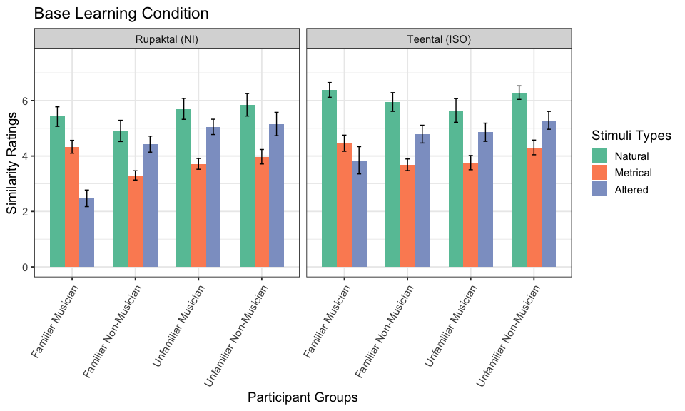
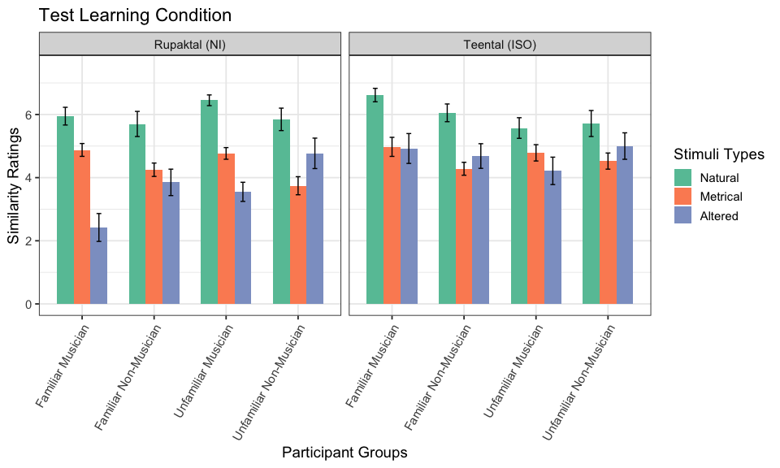
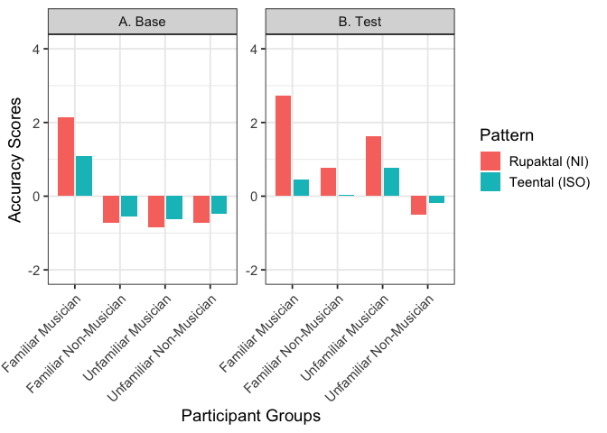

Summary Statistics
================
Nashra Ahmad
2024-02-20

# Initialise

## Libraries

``` r
library(emmeans)
library(dplyr)
library(ggplot2)
library(ggforce)
library(tidyverse)
library(ggplot2)
library(stringr)
library(lme4)
library(writexl)
```

## Read data

Reading the outlier removed data

``` r
dw2<-read.csv('Westerndata_outlierremoved.csv',skip = 0,header = TRUE)
dw2 <- subset(dw2, select = -Familiarity)
di2<-read.csv('Indiandata_outlierremoved.csv',skip = 0,header = TRUE)
```

## Combine data

``` r
dw2$Familiarity <- "Non-Indian"
di2$Familiarity <- "Indian"
dcom <- rbind(dw2, di2)
dcom <- dcom %>%filter(type != "Naturll" & type != "Naturl2") #remove testing stimuli
```

1.  Recode type into Natural, Metrical (Basic, Complex, SP1) or Altered
    (SD1)

``` r
dcom$type<-factor(dcom$type)
dcom$Alteration_Type <- factor(dcom$type,levels = c("Basic", "Complex", "Naturl", "sd1", "sp1"),labels = c("Metrical", "Metrical","Natural", "Altered", "Metrical"))
```

Note: Alteration_Type is Stimuli-Types, sd1 is Structurally Same, sd is
Altered.

## First, looking at the differences between the metrically same category

``` r
# Define patterns, conditions, and types
types_to_compare <- c("Basic", "Complex", "sp1")

# Pre-filter dataset for relevant columns and types
data_filtered <- dcom %>%
  filter(type %in% types_to_compare) %>%
  select(ResponseId, Musicianship, Familiarity,pattern, condition, type, similarity)

# LMM for all participant groups between Stimuli-Type
lm_met_m <- lmer(similarity ~ condition * pattern * Familiarity* Musicianship*type + (1 | ResponseId), data = data_filtered)
emm_met_m <- emmeans (lm_met_m,~  + condition+ pattern +Familiarity +   Musicianship +type+ pattern : type)
jt_met_m<-joint_tests(emm_met_m)
print(knitr::kable(jt_met_m))
```

    ## 
    ## 
    ## |   |model term                                      | df1|    df2| F.ratio|   p.value|
    ## |:--|:-----------------------------------------------|---:|------:|-------:|---------:|
    ## |1  |condition                                       |   1| 623.02|  37.814| 0.0000000|
    ## |17 |pattern                                         |   1| 124.82|   1.580| 0.2111147|
    ## |25 |Familiarity                                     |   1| 124.82|   0.148| 0.7010504|
    ## |29 |Musicianship                                    |   1| 124.82|   6.164| 0.0143648|
    ## |31 |type                                            |   2| 622.04|  33.175| 0.0000000|
    ## |2  |condition:pattern                               |   1| 623.02|   0.005| 0.9426487|
    ## |10 |condition:Familiarity                           |   1| 623.02|   0.486| 0.4861720|
    ## |14 |condition:Musicianship                          |   1| 623.02|   4.611| 0.0321500|
    ## |16 |condition:type                                  |   2| 622.04|   1.459| 0.2331590|
    ## |18 |pattern:Familiarity                             |   1| 124.82|   0.128| 0.7212402|
    ## |22 |pattern:Musicianship                            |   1| 124.82|   0.740| 0.3911529|
    ## |24 |pattern:type                                    |   2| 622.04|   5.520| 0.0042041|
    ## |26 |Familiarity:Musicianship                        |   1| 124.82|   3.335| 0.0702028|
    ## |28 |Familiarity:type                                |   2| 622.04|   0.215| 0.8065045|
    ## |30 |Musicianship:type                               |   2| 622.04|   0.852| 0.4270062|
    ## |3  |condition:pattern:Familiarity                   |   1| 623.02|   1.078| 0.2996088|
    ## |7  |condition:pattern:Musicianship                  |   1| 623.02|   0.050| 0.8231071|
    ## |9  |condition:pattern:type                          |   2| 622.04|   3.228| 0.0403033|
    ## |11 |condition:Familiarity:Musicianship              |   1| 623.02|  11.509| 0.0007365|
    ## |13 |condition:Familiarity:type                      |   2| 622.04|   0.057| 0.9444093|
    ## |15 |condition:Musicianship:type                     |   2| 622.04|   1.334| 0.2640725|
    ## |19 |pattern:Familiarity:Musicianship                |   1| 124.82|   0.334| 0.5642516|
    ## |21 |pattern:Familiarity:type                        |   2| 622.04|   1.676| 0.1880416|
    ## |23 |pattern:Musicianship:type                       |   2| 622.04|   2.242| 0.1071443|
    ## |27 |Familiarity:Musicianship:type                   |   2| 622.04|   0.193| 0.8243083|
    ## |4  |condition:pattern:Familiarity:Musicianship      |   1| 623.02|   1.051| 0.3056256|
    ## |6  |condition:pattern:Familiarity:type              |   2| 622.04|   1.875| 0.1542431|
    ## |8  |condition:pattern:Musicianship:type             |   2| 622.04|   0.629| 0.5335696|
    ## |12 |condition:Familiarity:Musicianship:type         |   2| 622.04|   0.209| 0.8111588|
    ## |20 |pattern:Familiarity:Musicianship:type           |   2| 622.04|   5.091| 0.0064095|
    ## |5  |condition:pattern:Familiarity:Musicianship:type |   2| 622.04|   0.254| 0.7757165|

``` r
pairwise_met_m <- pairs(emm_met_m, by = , adjust = "bonferroni")
pairwise_summary_m <- summary(pairwise_met_m)
jt_pairwise_m_df <- as.data.frame(pairwise_summary_m)
write_xlsx(jt_pairwise_m_df, "Stimuli Type Comparisons.xlsx")
```

As we found no significant interactions in Test, We combine all three
into Metrical

``` r
#Visualisation of only Test
vis_m <- data_filtered %>%
  filter(condition == "Test", type !="sd1") %>%
  mutate(Familiarity = ifelse(Familiarity == "Indian", "Familiar",
        ifelse(Familiarity == "Non-Indian", "Unfamiliar",Familiarity)),
  Groups = paste(Familiarity, Musicianship, sep = " "),
    pattern = ifelse(pattern == "Rupak", "Rupaktal (NI)", pattern),
    pattern = ifelse(pattern == "Teental", "Teental (ISO)", pattern),
  type = factor(type, levels = c("Basic", "Complex", "sp1"))
  ) %>%
  group_by(condition, Groups, pattern, type) %>%
  summarise(M = mean(similarity), n = n(), SE = sd(similarity) / sqrt(n), .groups = 'drop')

g_m <- ggplot(vis_m, aes(x = Groups, y = M, fill = type)) +
  geom_col(position = position_dodge(width = 0.7), width = 0.7) +
  geom_errorbar(aes(ymin = M - SE, ymax = M + SE), width = 0.2, position = position_dodge(width = 0.7)) +
  facet_wrap(~ pattern, scales = "fixed") +
  ylab("Similarity Ratings (Mean, SE)") +
  xlab("Participant Groups") +
  ggtitle(" Test Learning Condition") +
  theme_bw(base_size = 10) +
  theme(axis.text.x = element_text(angle = 60, vjust = 1, hjust = 1)) +
  labs(fill = "Metrical") +
  scale_fill_brewer(palette = "Set5")
```

    ## Warning: Unknown palette: "Set5"

``` r
g_m
```

<!-- -->

``` r
#Visualisation of only Base
vis_m2 <- data_filtered %>%
  filter(condition == "Base", type !="sd1") %>%
  mutate(Familiarity = ifelse(Familiarity == "Indian", "Familiar",
        ifelse(Familiarity == "Non-Indian", "Unfamiliar",Familiarity)),
  Groups = paste(Familiarity, Musicianship, sep = " "),
    pattern = ifelse(pattern == "Rupak", "Rupaktal (NI)", pattern),
    pattern = ifelse(pattern == "Teental", "Teental (ISO)", pattern),
  type = factor(type, levels = c("Basic", "Complex", "sp1"))
  ) %>%
  group_by(condition, Groups, pattern, type) %>%
  summarise(M = mean(similarity), n = n(), SE = sd(similarity) / sqrt(n), .groups = 'drop')

g_m2 <- ggplot(vis_m2, aes(x = Groups, y = M, fill = type)) +
  geom_col(position = position_dodge(width = 0.7), width = 0.7) +
  geom_errorbar(aes(ymin = M - SE, ymax = M + SE), width = 0.2, position = position_dodge(width = 0.7)) +
  facet_wrap(~ pattern, scales = "fixed") +
  ylab("Similarity Ratings (Mean, SE)") +
  xlab("Participant Groups") +
  ggtitle(" Base Learning Condition") +
  theme_bw(base_size = 10) +
  theme(axis.text.x = element_text(angle = 60, vjust = 1, hjust = 1)) +
  labs(fill = "Metrical") +
  scale_fill_brewer(palette = "Set5")
```

    ## Warning: Unknown palette: "Set5"

``` r
g_m2
```

<!-- -->
\# Analysis

## Change in Metrical Structure on Similarity perception

Visualizations

<!-- --><!-- -->
Statistics:

``` r
#putting everything in tables
lm_met1.1 <- lmer(similarity ~ condition * pattern * Familiarity* Musicianship*Alteration_Type + (1 | ResponseId), data = dcom)

emm_met1.1 <- emmeans (lm_met1.1,~  + condition+ pattern +Familiarity +   Musicianship +Alteration_Type+ pattern : Alteration_Type)
jt_met1.1<-joint_tests(emm_met1.1)
print(knitr::kable(jt_met1.1))
```

    ## 
    ## 
    ## |   |model term                                                 | df1|     df2| F.ratio|   p.value|
    ## |:--|:----------------------------------------------------------|---:|-------:|-------:|---------:|
    ## |1  |condition                                                  |   1| 1153.29|   3.513| 0.0611526|
    ## |17 |pattern                                                    |   1|  141.83|   6.627| 0.0110679|
    ## |25 |Familiarity                                                |   1|  141.83|   2.329| 0.1292184|
    ## |29 |Musicianship                                               |   1|  141.83|   0.143| 0.7056877|
    ## |31 |Alteration_Type                                            |   2| 1152.03| 147.469| 0.0000000|
    ## |2  |condition:pattern                                          |   1| 1153.29|   0.021| 0.8855581|
    ## |10 |condition:Familiarity                                      |   1| 1153.29|   6.263| 0.0124678|
    ## |14 |condition:Musicianship                                     |   1| 1153.29|   2.146| 0.1431934|
    ## |16 |condition:Alteration_Type                                  |   2| 1152.03|  10.720| 0.0000244|
    ## |18 |pattern:Familiarity                                        |   1|  141.83|   3.516| 0.0628504|
    ## |22 |pattern:Musicianship                                       |   1|  141.83|   0.014| 0.9075094|
    ## |24 |pattern:Alteration_Type                                    |   2| 1152.03|   3.472| 0.0313916|
    ## |26 |Familiarity:Musicianship                                   |   1|  141.83|   0.682| 0.4103977|
    ## |28 |Familiarity:Alteration_Type                                |   2| 1152.03|  10.460| 0.0000315|
    ## |30 |Musicianship:Alteration_Type                               |   2| 1152.03|  21.556| 0.0000000|
    ## |3  |condition:pattern:Familiarity                              |   1| 1153.29|   0.026| 0.8718512|
    ## |7  |condition:pattern:Musicianship                             |   1| 1153.29|   0.413| 0.5203540|
    ## |9  |condition:pattern:Alteration_Type                          |   2| 1152.03|   3.340| 0.0357838|
    ## |11 |condition:Familiarity:Musicianship                         |   1| 1153.29|   0.118| 0.7308635|
    ## |13 |condition:Familiarity:Alteration_Type                      |   2| 1152.03|   1.426| 0.2406010|
    ## |15 |condition:Musicianship:Alteration_Type                     |   2| 1152.03|   0.389| 0.6779398|
    ## |19 |pattern:Familiarity:Musicianship                           |   1|  141.83|   1.487| 0.2246784|
    ## |21 |pattern:Familiarity:Alteration_Type                        |   2| 1152.03|   6.662| 0.0013282|
    ## |23 |pattern:Musicianship:Alteration_Type                       |   2| 1152.03|   3.464| 0.0316372|
    ## |27 |Familiarity:Musicianship:Alteration_Type                   |   2| 1152.03|   3.679| 0.0255377|
    ## |4  |condition:pattern:Familiarity:Musicianship                 |   1| 1153.29|   0.369| 0.5438620|
    ## |6  |condition:pattern:Familiarity:Alteration_Type              |   2| 1152.03|   0.588| 0.5553867|
    ## |8  |condition:pattern:Musicianship:Alteration_Type             |   2| 1152.03|   0.505| 0.6035462|
    ## |12 |condition:Familiarity:Musicianship:Alteration_Type         |   2| 1152.03|   6.829| 0.0011264|
    ## |20 |pattern:Familiarity:Musicianship:Alteration_Type           |   2| 1152.03|   0.607| 0.5452257|
    ## |5  |condition:pattern:Familiarity:Musicianship:Alteration_Type |   2| 1152.03|   0.166| 0.8474775|

``` r
jt_met1.1_df <- as.data.frame(jt_met1.1)
library(writexl)
write_xlsx(jt_met1.1_df, "jt_met1_1.xlsx")
pairwise_met_overall <- pairs(emm_met1.1, by = , adjust = "bonferroni")
pairwise_summary_overall <- summary(pairwise_met_overall)

#Overall comparison of alteration types for only Test Learning Condition
meter_overall <- dcom %>%
  filter(condition != "Base")
lm_met1 <- lmer(similarity ~ pattern * Familiarity* Musicianship*Alteration_Type + (1 | ResponseId), data = meter_overall)
emm_met1 <- emmeans (lm_met1,~  + pattern +Familiarity +   Musicianship +Alteration_Type+ pattern : Alteration_Type)
jt_met1<-joint_tests(emm_met1)
print(knitr::kable(jt_met1))
```

    ## 
    ## 
    ## |   |model term                                       | df1|    df2| F.ratio|   p.value|
    ## |:--|:------------------------------------------------|---:|------:|-------:|---------:|
    ## |1  |pattern                                          |   1| 151.56|   5.193| 0.0240748|
    ## |9  |Familiarity                                      |   1| 151.56|   0.025| 0.8743818|
    ## |13 |Musicianship                                     |   1| 151.56|   0.090| 0.7640919|
    ## |15 |Alteration_Type                                  |   2| 512.00|  68.961| 0.0000000|
    ## |2  |pattern:Familiarity                              |   1| 151.56|   2.808| 0.0958440|
    ## |6  |pattern:Musicianship                             |   1| 151.56|   0.185| 0.6678033|
    ## |8  |pattern:Alteration_Type                          |   2| 512.00|   5.690| 0.0035986|
    ## |10 |Familiarity:Musicianship                         |   1| 151.56|   0.280| 0.5975712|
    ## |12 |Familiarity:Alteration_Type                      |   2| 512.00|   2.202| 0.1116349|
    ## |14 |Musicianship:Alteration_Type                     |   2| 512.00|  13.528| 0.0000019|
    ## |3  |pattern:Familiarity:Musicianship                 |   1| 151.56|   1.897| 0.1704321|
    ## |5  |pattern:Familiarity:Alteration_Type              |   2| 512.00|   5.481| 0.0044148|
    ## |7  |pattern:Musicianship:Alteration_Type             |   2| 512.00|   3.223| 0.0406438|
    ## |11 |Familiarity:Musicianship:Alteration_Type         |   2| 512.00|   0.250| 0.7789860|
    ## |4  |pattern:Familiarity:Musicianship:Alteration_Type |   2| 512.00|   0.074| 0.9286675|

``` r
#1. for overall pattern and alteration type
emm_met_overall<- emmeans (lm_met1,~  pattern*Alteration_Type )
```

    ## NOTE: Results may be misleading due to involvement in interactions

``` r
pairwise_met1 <- pairs(emm_met_overall, by = , adjust = "bonferroni")
pairwise_summary_met1 <- summary(pairwise_met1)
#2. for all factors
pairwise_met2 <- pairs(emm_met1, by = , adjust = "bonferroni")
pairwise_summary_met2 <- summary(pairwise_met2)
```

Checking whether irrespective of the Condition, if there was a
difference in experts vs others

``` r
emm_subset <- emmeans(lm_met1.1, ~  pattern*Familiarity * Musicianship*Alteration_Type)
```

    ## NOTE: Results may be misleading due to involvement in interactions

``` r
pairwise_fam_mus_teental <- pairs(emm_subset, adjust = "bonferroni")
print("All pairwise comparisons for Alteration Type, Familiarity, and Musicianship in Teental pattern:")
```

    ## [1] "All pairwise comparisons for Alteration Type, Familiarity, and Musicianship in Teental pattern:"

``` r
#summary(pairwise_fam_mus_teental)
pairwise_summary_Teen <- summary(pairwise_fam_mus_teental)
```

## Accuracy Scores of IS and NI and Effect of Learning

This has not been reported in the paper as we did not want to provide
differences between the rhythmic cycles but is a way to compare ISO and
NI like Hannon et al. (2012).

2.  Plots

<!-- -->

    ## `summarise()` has grouped output by 'ResponseId', 'condition', 'pattern',
    ## 'Groups', 'Familiarity'. You can override using the `.groups` argument.
    ## `summarise()` has grouped output by 'pattern', 'Groups'. You can override using
    ## the `.groups` argument.
    ## `summarise()` has grouped output by 'pattern', 'Groups'. You can override using
    ## the `.groups` argument.

<!-- -->

    ## Saving 10 x 6 in image

    ## [1] "Plot saved as g_acc2_plot.png with 300 DPI"

Statistics for accuracy perception:

``` r
#1. Base

acc_base <- d_accuracy %>%
  filter(condition == "Base")
lm_acc1 <- lm(Difference_Scores ~ pattern * Familiarity*Musicianship, data = acc_base)
emm_acc <- emmeans (lm_acc1,~  pattern*Familiarity*Musicianship )
pairwise_acc <- pairs(emm_acc, by = , adjust = "bonferroni")
pairwise_summary_acc <- summary(pairwise_acc)

#2. Test

acc_Test <- d_accuracy %>%
  filter(condition == "Test")
lm_acc2 <- lm(Difference_Scores ~ pattern * Familiarity*Musicianship, data = acc_Test)
emm_acc2 <- emmeans (lm_acc2,~  pattern*Familiarity*Musicianship )
pairwise_acc2 <- pairs(emm_acc2, by = , adjust = "bonferroni")
pairwise_summary_acc2<- summary(pairwise_acc2)

#overall for effect of short term learning
m2 <- lmer(Difference_Scores ~ pattern * Familiarity * Musicianship  * condition + (1 | ResponseId), data = d_accuracy)
emm_acc3 <- emmeans(m2, ~  pattern + Familiarity + condition + pattern + Musicianship : Familiarity + pattern : condition + Musicianship : condition )
jt_acc3<-joint_tests(emm_acc3)
print(knitr::kable(jt_acc3))
```

    ## 
    ## 
    ## |   |model term                                 | df1|    df2| F.ratio|   p.value|
    ## |:--|:------------------------------------------|---:|------:|-------:|---------:|
    ## |1  |pattern                                    |   1| 124.74|   4.019| 0.0471420|
    ## |9  |Familiarity                                |   1| 124.74|  12.278| 0.0006371|
    ## |13 |condition                                  |   1| 124.34|  24.901| 0.0000020|
    ## |15 |Musicianship                               |   1| 124.74|  24.502| 0.0000024|
    ## |2  |pattern:Familiarity                        |   1| 124.74|   3.596| 0.0602220|
    ## |6  |pattern:condition                          |   1| 124.34|   5.907| 0.0165053|
    ## |8  |pattern:Musicianship                       |   1| 124.74|   4.123| 0.0444411|
    ## |10 |Familiarity:condition                      |   1| 124.34|   3.413| 0.0670807|
    ## |12 |Familiarity:Musicianship                   |   1| 124.74|   4.316| 0.0398066|
    ## |14 |condition:Musicianship                     |   1| 124.34|   0.955| 0.3302586|
    ## |3  |pattern:Familiarity:condition              |   1| 124.34|   0.785| 0.3773574|
    ## |5  |pattern:Familiarity:Musicianship           |   1| 124.74|   0.637| 0.4264829|
    ## |7  |pattern:condition:Musicianship             |   1| 124.34|   1.372| 0.2437214|
    ## |11 |Familiarity:condition:Musicianship         |   1| 124.34|  18.086| 0.0000411|
    ## |4  |pattern:Familiarity:condition:Musicianship |   1| 124.34|   0.436| 0.5102151|

``` r
pairwise_acc3 <- pairs(emm_acc3, by = , adjust = "bonferroni")
pairwise_summary_acc3 <- summary(pairwise_acc3)
```
